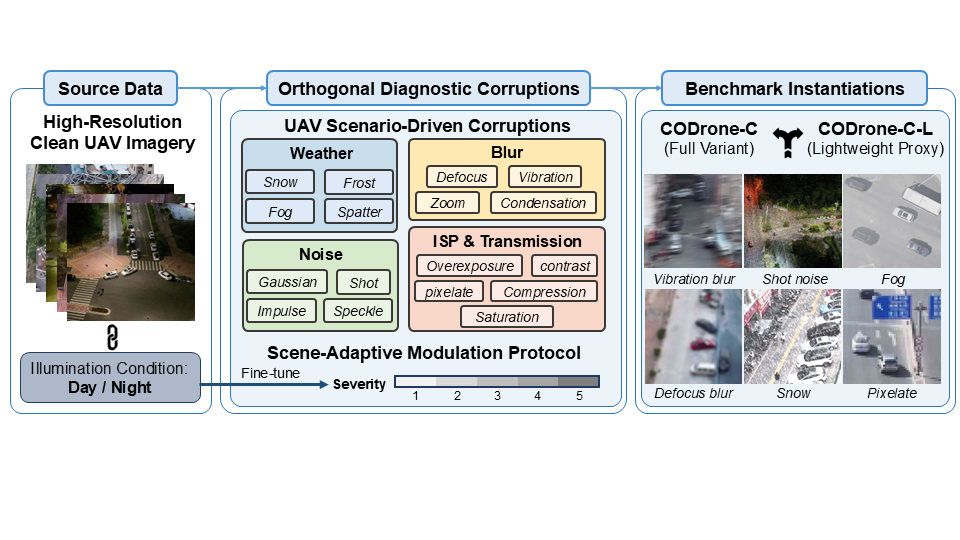
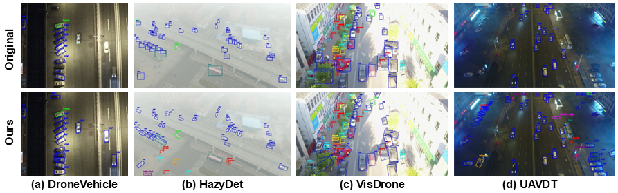
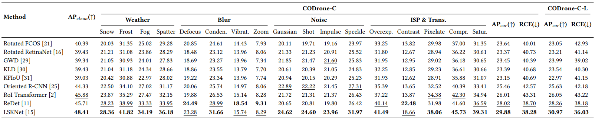
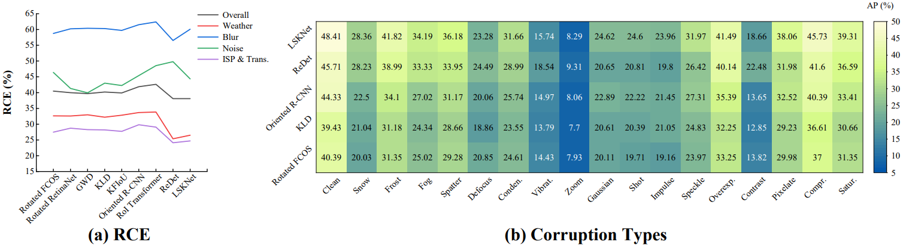
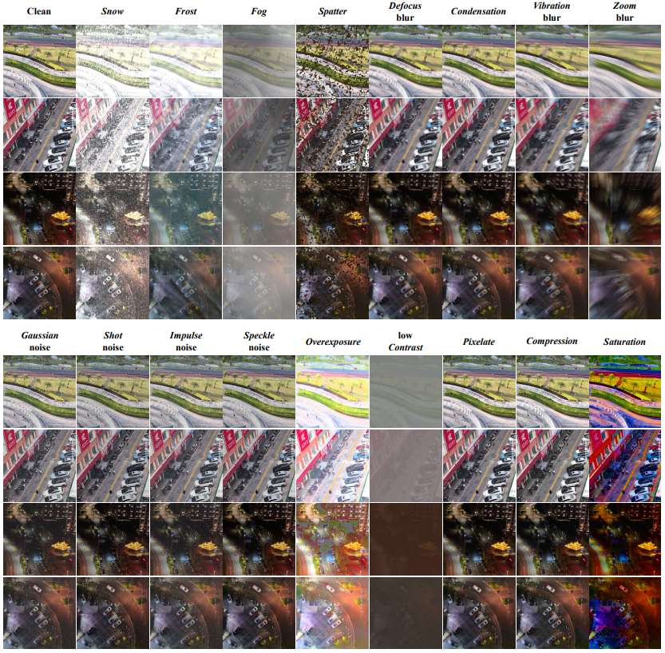

<p align="center">
  <h1 align="center"> 🛸 Beyond Clean Data: An Open, Comprehensive Benchmark for Robustness Evaluation in UAV-Oriented Object Detection</h1>
  <p align="center">
    <strong>Ao Gong</strong> · <strong>Chenlin Fu</strong> · <strong>Hao Yu</strong> · <strong>Yingying Zhu</strong>
  </p>
  <p align="center">
        <a href="./Appendix.pdf"></a>
        <a href='#-the-benchmark-suite--real-world-subset'></a>
        <a href='https://2026.acmmm.org/'></a>
  </p>
</p>

> **🎉 News:** This repository is the official project page for our Dataset Track submission to **ACM Multimedia 2026**.

## 😊 TL;DR

We introduce **CODrone-C** and **CODrone-C-L**, a comprehensive dual-benchmark suite featuring 17 decoupled stress tests explicitly parameterized to systematically evaluate the robustness of UAV-oriented object detectors.

## 📖 Abstract

Robust evaluation of UAV-oriented object detection (UAV-OOD) should go beyond clean imagery, as deployed systems routinely encounter adverse weather, motion-induced blur, and signal degradation. To bridge the gap between idealized training and physical deployment, we construct two robustness benchmarks, CODrone-C and CODrone-C-L, which subject oriented detectors to decoupled diagnostic stress tests under day and night conditions. CODrone-C spans 17 hazard types at five severities for exhaustive vulnerability diagnosis, while CODrone-C-L serves as a lightweight proxy for rapid model screening. A condition-specific Scene-Adaptive Modulation Protocol calibrates corruption intensities across illumination regimes to prevent non-physical artifacts. Extensive evaluations of nine state-of-the-art models uncover critical robustness insights, notably a severe day-night asymmetry where low-light conditions fundamentally amplify model vulnerability to unstructured noise. Furthermore, to validate the diagnostic fidelity of our benchmark, we curate Real-Adv135, a manually re-annotated real-world adverse evaluation subset. By demonstrating a strong semantic alignment between our synthetic stress tests and authentic operational failure modes via zero-shot transfer on Real-Adv135, we confirm the reliability of our diagnostic proxy. Ultimately, our dual-benchmark suite provides the community with a standardized tool to diagnose vulnerabilities and develop intrinsically resilient UAV-OOD models.

<div align="center">
  
  <p><em>We systematically construct our decoupled diagnostic framework upon high-resolution clean UAV imagery, strictly calibrated by our Scene-Adaptive Modulation Protocol to ensure physical plausibility across day and night conditions.</em></p>
</div>

---

## 📦 The Benchmark Suite & Real-World Subset

### 📥 Dataset Downloads

> **⚠️ Notice:** Due to the massive scale of the benchmark, some corruption subsets of CODrone-C are currently syncing to our cloud servers. However, the core foundational subsets (including `CODrone-C-L`, `Real-Adv135`, and representative corruptions from the full suite) are fully available for immediate download and review. The links below are permanent and will automatically reflect the latest uploads.

* **Google Drive (Recommended):** [Click Here to Access](https://drive.google.com/drive/folders/1r-fv2tbjeJhyVO8VOUyqgoN_DX7p1jhm?usp=sharing)
* **Baidu Netdisk (Alternative):** [Click Here to Access](https://pan.baidu.com/s/13lJYwz2tFu7dXIij1wpgQQ?pwd=jum6) (Access Code: `jum6`)

---

Our project provides a complete ecosystem for UAV-OOD robustness evaluation, tailored for diverse diagnostic needs:

### 1. CODrone-C (Exhaustive Diagnosis Variant)
The full variant encompasses **17 decoupled hazard types** (Weather, Blur, Noise, Digital) across **5 severity levels**. It is designed for deep, fine-grained vulnerability profiling, allowing researchers to pinpoint the exact physical weaknesses of their network architectures.

### 2. CODrone-C-L (Lightweight Proxy Variant)
A rigorously quantified, sub-sampled version of the full benchmark. It drastically reduces evaluation overhead while strictly maintaining the performance ranking and diagnostic trends of the full dataset, making it ideal for rapid, iterative model screening during the training phase.

### 3. Real-Adv135 (Authentic Evaluation Subset)
To strictly validate the transferability of our synthetic stress tests, we curated and manually re-annotated 135 severely degraded real-world images (sourced from DroneVehicle, HazyDet, VisDrone, and UAVDT). All instances were meticulously re-annotated with precise Rotated Bounding Boxes (RBox).

<div align="center">
  
  <p><em>Qualitative comparison demonstrating our precise manual RBox annotations (right) effectively rescuing targets missed or poorly enclosed by original coarse horizontal boxes (left) under extreme real-world degradations.</em></p>
</div>

### 📂 Directory Structure

Once fully downloaded, the dataset follows this organization:

```shell
CODrone-C_Benchmark/
├── CODrone-C/               # Full diagnostic variant (17 corruptions x 5 levels)
│   ├── compression/         # Corruptions
|      ├── 1/                # Severities
|      ├── 2/
|      ├── 3/
|      ├── 4/
|      ├── 5/
│   ├── condensation/
│   ├── contrast/
│   ├── defocus/
│   ├── ...
│   ├── vibration/
│   └── zoom/
├── CODrone-C-L/             # Lightweight proxy variant
├── Real-Adv135/             # Real-world adverse evaluation subset
|   ├── imgs/
│   └── anns/
└── annotations/             # RBox annotations for CODrone-C and CODrone-C-L
```

### 📊 Comprehensive Benchmarking Results
Extensive evaluations of 9 state-of-the-art UAV-OOD models on our benchmark suite reveal that superior clean-domain accuracy does not naturally guarantee resilience against physical hazards.

<div align="center">
  
  
  <p><em>Overall performance drops and specific architectural vulnerability profiles across 17 decoupled corruptions.</em></p>
</div>

### 👁️ Qualitative Visualizations of Diagnostic Stress
Our 17 decoupled corruptions are designed as orthogonal diagnostic stress tests. They do not merely degrade the image; they systematically attack specific structural components of the detectors.

<div align="center">
  
</div>

### 📄 Supplementary Material
Due to the strict page limit of the ACM MM Dataset Track, all detailed hyperparameter settings, Scene-Adaptive Modulation parameters, complete AP75 evaluation tables, and Corruption-Augmented Training (CAT) results are provided in our technical whitepaper.

👉 **[Click here to view the Supplementary Material PDF](./Appendix.pdf)**
